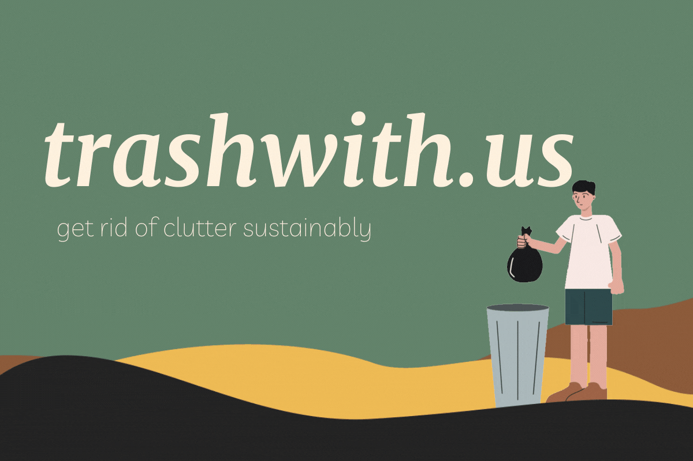

<h1 align="center"> trashwith.us</h1>

> a website that gives you suggestions on how to get rid of your unwanted items responsibly and sustainably
## [Live Demo](trashwith.us)

* [Devpost Project](https://www.npmjs.com/package/react-tooltip)

## Dependencies
### Frontend
* `react`
* `react-dom`
* `react-scripts`
* [`react-icons`](https://www.npmjs.com/package/react-icons)
* [`react-tooltip`](https://www.npmjs.com/package/react-tooltip)
* [`axios`](https://www.npmjs.com/package/axios)

### Backend
* `express`
* `mysql2`
* `sequelize`
* `sequelize-cli`
* `cors`
* `nodemon`

## Installation
* TODO