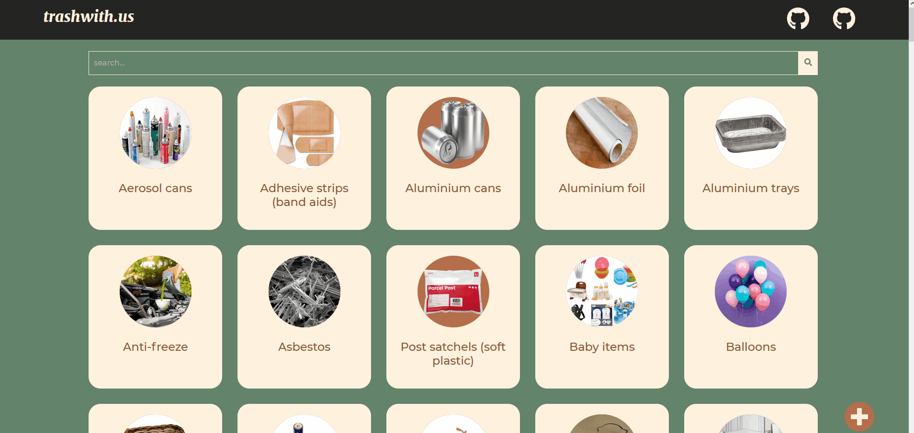

<h1 align="center"> trashwith.us</h1>

> a website that gives you suggestions on how to get rid of your unwanted items responsibly and sustainably
## [Live Demo](trashwith.us)

* [Alternative Demo Link (Heroku)](https://trashwithus.herokuapp.com/)
* [Devpost Project](https://devpost.com/software/trashwith-us)

## ✨ What it does
* trashwith.us is a website that gives you suggestions on how to get rid of your unwanted items responsibly and sustainably
* **Search:** find out how to get rid of items that are cluttering your home
* **Sustainable suggestions:** the website suggests several ways for you to get rid of your items sustainably
* **Save the world:** there are many things that do not belong in the landfill - find out how to get rid of them sustainably and responsibly

## Dependencies
### Frontend
* `react`
* `react-dom`
* `react-scripts`
* [`react-icons`](https://www.npmjs.com/package/react-icons)
* [`react-tooltip`](https://www.npmjs.com/package/react-tooltip)
* [`axios`](https://www.npmjs.com/package/axios)

### Backend
* `express`
* `mysql2`
* `sequelize`
* `sequelize-cli`
* `cors`
* `nodemon`
